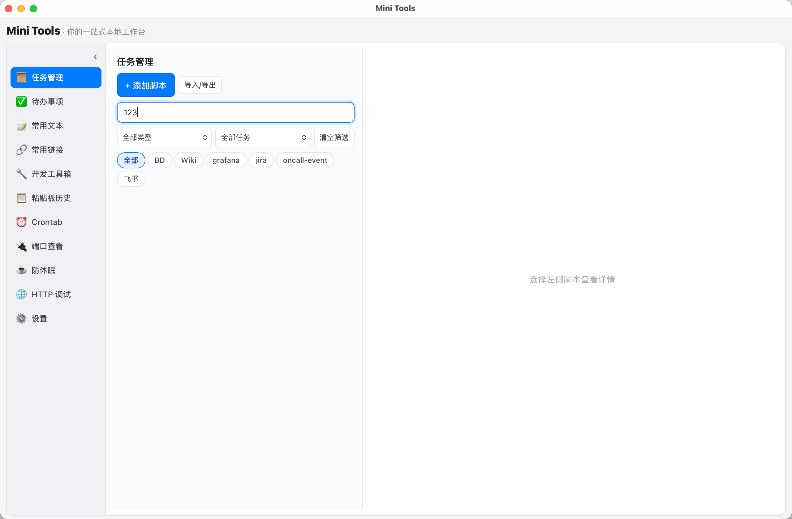

<div align="center">

# Mini Tools

**一个轻量、本地、离线的 macOS 开发者工具箱**

基于 [Tauri 2](https://v2.tauri.app/) + TypeScript 构建，所有数据本地处理，无需上传到任何在线服务。

[](./LICENSE)
[](https://github.com/aapple/mini-tools/releases/latest)
[](https://tauri.app/start/prerequisites/)

</div>

---

## 软件截图



## 为什么选择 Mini Tools？

- **离线安全** — 所有文本处理均在本地完成，API Token、内部 JSON 等敏感数据不会离开你的电脑
- **原生体验** — 基于 Tauri 的原生窗口，体积极小、启动极快，资源占用远低于 Electron 应用
- **功能聚合** — 将日常开发最常用的 13+ 工具集成在一个窗口中，告别在多个网页工具间来回切换
- **全局唤起** — `⌘⇧Space` 一键呼出/隐藏，`⌘K` 全局搜索，随时随地使用，不打断工作流
- **高度可定制** — 菜单项可自由显示/隐藏、排序调整，打造属于你的工具集

## 功能特性

### 开发工具箱（13 个工具）

| 工具 | 说明 |
|------|------|
| **JSON 格式化** | 美化 JSON，支持结构化查看与关键字搜索 |
| **XML 格式化** | 美化 XML，支持结构化查看与关键字搜索 |
| **文本差异比较** | 左右双栏对比，高亮差异部分，支持复制差异文本 |
| **JWT 解析** | 解析 JWT Token 的 Header、Payload 和签名信息 |
| **Markdown 渲染** | 实时预览 Markdown 渲染结果 |
| **时间戳转换** | Unix 时间戳与可读时间互转，支持自定义时区偏移 |
| **HTML 编解码** | HTML 实体编码/解码，双按钮一键操作 |
| **URL 编解码** | URL 百分号编码/解码，双按钮一键操作 |
| **Base64 编解码** | Base64 自动编码/解码，智能识别输入格式 |
| **JSON / YAML 互转** | JSON 与 YAML 格式互转，自动检测输入格式 |
| **正则表达式测试** | 实时测试正则表达式，支持多种匹配模式 |
| **文本统计** | 统计字符数、单词数、行数等文本信息 |
| **二维码生成** | 输入文本生成二维码图片 |

### 效率增强

| 功能 | 说明 |
|------|------|
| **全局搜索** | `⌘K` 唤起，快速搜索并跳转到任意功能模块或具体内容 |
| **全局快捷键** | 可配置的系统级快捷键（默认 `⌘⇧Space`），支持录制自定义按键组合 |
| **HTTP 调试** | 发送 HTTP 请求，查看响应头、状态码、响应体，支持多种请求方法 |
| **端口查看** | 查看本机端口占用情况，一键终止占用进程 |
| **macOS 防休眠** | 内置 `caffeinate` 控制，防止显示器/系统休眠，一键开关（支持系统托盘快捷操作） |
| **剪贴板历史** | 自动记录剪贴板内容（最多 100 条），随时回溯查找 |
| **最近历史** | 保存最近 20 次工具执行记录，可恢复输入并重新执行 |
| **文本片段** | 保存、搜索、一键复制常用文本模板（最多 100 条） |
| **书签管理** | 收藏常用链接，支持分组管理 |
| **待办清单** | 创建、完成、导入/导出任务，支持截止日期、详情描述和链接 |
| **文件导入** | JSON/XML/Markdown 文件支持拖拽或选择文件导入 |

### 脚本与任务管理

这是项目最核心的高级功能，适合需要在本地运行和管理脚本的开发者：

| 功能 | 说明 |
|------|------|
| **多类型脚本** | 支持 Python3、Shell、Commands（多行命令顺序执行） |
| **脚本管理** | 增删改查，支持名称、路径、描述、默认参数、标签 |
| **异步执行** | 后台异步运行，stdout/stderr 写入日志文件，实时跟踪退出码 |
| **进程管理** | 完整的进程组终止（`setpgid` + `kill -TERM`），中断安全可靠 |
| **定时调度** | 支持标准 cron 表达式、简易间隔语法（`every_5m`、`every_2h`、`every_1d`） |
| **运行历史** | 最多 200 条执行记录，包含状态、退出码、耗时、日志路径 |
| **标签筛选** | 按标签、类型、定时状态、关键字过滤脚本 |
| **导入导出** | 将选中脚本导出为 JSON，支持去重导入 |
| **日志查看** | 应用内直接查看脚本运行日志，支持自定义日志目录 |
| **Crontab 编辑器** | 可视化编辑系统 crontab，支持完整语法校验 |

### 个性化设置

| 功能 | 说明 |
|------|------|
| **菜单配置** | 自由显示/隐藏菜单项，拖拽排序调整位置 |
| **快捷键配置** | 支持录制自定义快捷键组合 |
| **版本更新** | 应用内检查更新、下载、安装，支持跳过指定版本 |

## 技术栈

| 层级 | 技术 |
|------|------|
| **桌面框架** | Tauri 2 |
| **前端** | TypeScript + Vite 6 + Vanilla DOM（无框架） |
| **后端** | Rust（Tokio 异步运行时） |
| **关键依赖** | `arboard`（剪贴板）、`rfd`（文件对话框）、`chrono`（时间处理）、`marked`（Markdown 渲染）、`qrcode`（二维码生成）、`js-yaml`（YAML 处理） |
| **CI/CD** | GitHub Actions（tag 触发自动构建发布） |
| **自动更新** | Tauri Updater + 独立公开更新仓库 |

## 安装

### 下载预构建版本

前往 [Releases](https://github.com/aapple/mini-tools-updater/releases/latest) 页面下载最新版本的 `.dmg` 安装包，支持 Intel 和 Apple Silicon Mac。

### macOS 首次启动

由于应用未经过 Apple 公证签名，首次打开时可能会提示 **"Mini Tools 已损坏，无法打开"** 或 **"无法验证开发者"**。

**解决方法（推荐）**：打开终端，执行以下命令绕过公证检查：

```bash
xattr -dr com.apple.quarantine "/Applications/Mini Tools.app"
```

执行后再次双击应用即可正常打开。

### 应用内更新

应用内置自动更新功能：

- 启动时自动检查更新（可关闭）
- 手动检查更新
- 支持跳过指定版本
- 下载完成后提示重启安装

更新源托管在公开仓库：[aapple/mini-tools-updater](https://github.com/aapple/mini-tools-updater)

## 本地开发

### 环境要求

- [Node.js](https://nodejs.org/)（LTS 版本）
- [Rust](https://www.rust-lang.org/tools/install) 工具链
- [Tauri 前置依赖](https://v2.tauri.app/start/prerequisites/)

### 启动开发模式

```bash
# 安装依赖
npm install

# 启动开发服务器（Vite + Tauri）
npm run tauri dev
```

macOS 用户也可以直接双击根目录下的 `start-dev.command` 一键启动（首次运行会自动安装依赖）。

### 构建生产版本

```bash
npm run tauri build
```

构建产物位于 `src-tauri/target/release/bundle/`，包含 `.app` 和 `.dmg` 文件。

## 发布流程

### 方式一：使用 release.sh（推荐）

```bash
# 自动递增 patch 版本号
./release.sh

# 指定版本号
./release.sh -v 2.0.0

# 递增 minor 版本号
./release.sh --bump minor
```

脚本会自动完成：版本号更新 → 提交 → 打 tag → 推送到远程。

### 方式二：手动打 tag

```bash
git tag v1.0.48
git push origin v1.0.48
```

推送 `v*` tag 后，GitHub Actions 会自动：

1. 在 macOS 上构建应用（支持 Intel + Apple Silicon）
2. 创建 GitHub Release 并上传签名产物
3. 将更新产物同步到公开更新仓库

### CI 配置

在 GitHub 仓库中配置以下 Secrets / Variables：

| 名称 | 类型 | 说明 |
|------|------|------|
| `TAURI_SIGNING_PRIVATE_KEY` | Secret | Tauri 更新签名私钥 |
| `TAURI_SIGNING_PRIVATE_KEY_PASSWORD` | Secret | 签名私钥密码 |
| `UPDATER_PUBLIC_REPO` | Variable | 公开更新仓库，如 `aapple/mini-tools-updater` |
| `UPDATER_PUBLIC_REPO_PAT` | Secret | 更新仓库 PAT，需 `contents:write` 权限 |

## 项目结构

```
mini-tools/
├── index.html                 # 页面结构（单页应用）
├── package.json               # Node.js 配置
├── vite.config.ts             # Vite 构建配置
├── start-dev.command          # macOS 一键启动脚本
├── release.sh                 # 版本发布脚本
├── src/
│   ├── main.ts                # 前端逻辑（TypeScript）
│   └── styles.css             # 样式
├── src-tauri/
│   ├── Cargo.toml             # Rust 依赖
│   ├── tauri.conf.json        # Tauri 应用配置
│   └── src/
│       ├── main.rs            # Rust 入口
│       ├── lib.rs             # 核心逻辑（快捷键、防休眠、剪贴板、HTTP、端口）
│       └── scripts.rs         # 脚本管理引擎（执行、调度、日志）
└── .github/workflows/
    └── release.yml            # CI/CD 自动构建发布
```

## License

本项目基于 [MIT License](./LICENSE) 开源。
